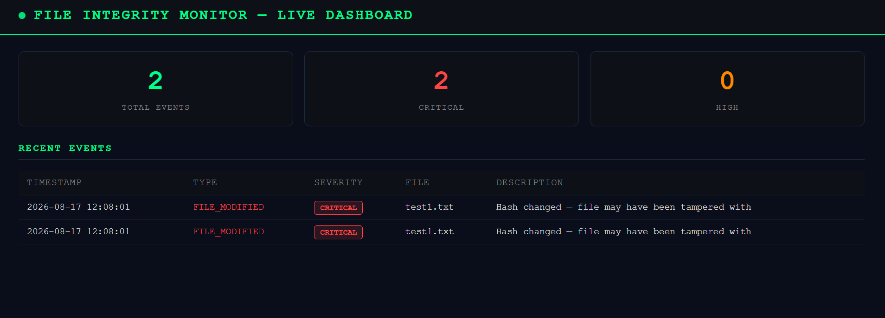

# File Integrity Monitor

A real-time File Integrity Monitor (FIM) built with Python, watchdog, and Flask. Monitors a directory for unauthorized file changes, detects tampering via SHA256 hashing, and displays live alerts on a web dashboard.

## Features

- Real-time monitoring — detects file modifications, creations, and deletions instantly
- SHA256 hashing — compares file hashes against a trusted baseline to detect tampering
- SQLite logging — all events stored persistently with timestamps
- Live web dashboard — auto-refreshes every 3 seconds with severity badges
- Baseline scanner — indexes all files on startup to establish a trusted state

## Dashboard Preview

## Project Structure

    file-integrity-monitor/
    ├── src/
    │   ├── database.py      # SQLite setup and queries
    │   ├── hasher.py        # SHA256 hashing and directory scanner
    │   ├── watcher.py       # Real-time file watcher using watchdog
    │   └── alerter.py       # Event saving and retrieval
    ├── templates/
    │   └── index.html       # Flask dashboard UI
    ├── watched_folder/      # Directory being monitored
    ├── logs/                # SQLite database and event logs
    ├── main.py              # FIM engine entry point
    ├── app.py               # Flask dashboard entry point
    └── requirements.txt

## Installation

    git clone https://github.com/Stavros-Saridis/file-integrity-monitor.git
    cd file-integrity-monitor
    python -m venv venv
    venv\Scripts\activate
    pip install -r requirements.txt

## Usage

Terminal 1 — Start FIM engine:

    python main.py

Terminal 2 — Start dashboard:

    python app.py

Open browser at http://127.0.0.1:5001

## Testing

With the FIM running, modify a file in watched_folder:

    echo "tampered" > watched_folder\test1.txt

The dashboard will display a FILE_MODIFIED alert with CRITICAL severity instantly.

## How It Works

On startup, the FIM scans the watched_folder and saves the SHA256 hash of every file to a SQLite database — this is the baseline. The watchdog library then monitors the directory in real time. When a file changes, the new hash is compared against the baseline. If they differ, a CRITICAL alert is raised. New files trigger HIGH alerts, deleted files trigger CRITICAL alerts.

## Tech Stack

| Tool | Purpose |
|------|---------|
| Python 3.12 | Core language |
| watchdog 6.0 | Real-time file system monitoring |
| Flask 3.1 | Web dashboard |
| SQLite | Event and baseline storage |
| hashlib | SHA256 file hashing |

## Author

Stavros Saridis — BSc Computer Science (First Class Honours), University of Derby
MSc Cybersecurity student | Aspiring SOC Analyst
GitHub: https://github.com/Stavros-Saridis
LinkedIn: https://linkedin.com/in/stavros-saridis